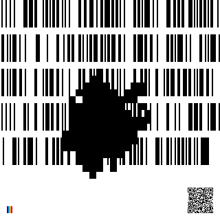

<p align="center">
	
</p>

# `Solution for 0xfe`

0xfe is a puzzle in svg format with 24 mnemonic words hidden inside.
The first step is to inspect the svg. Most browser will let you navigate it as if it was html.
In the main block there's 27 `<g>` elements
- 1 is the barcode (hint * 2)
- 1 is the QR code for the address (info)
- 24 are mnemonics (puzzle)
- 1 is the rainbow (hint)

## `Barcode`

The barcode has two hints the first is in binary
`"I wake from my slumber 8 blinks of my eyes and life changes I have to find a way to claw back time?"`

The second is hidden in the style of each <rect> in hex
`"player 0 has joined the game"`

<p align="center">
	
</p>

Here is an example of how to extract the hints. This a snippet from the puzzles tests.
``` javascript
fs.readFile('puzzle.svg').then((res) => {
	return res.toString().match(/<g>.*?<\/g>/g); // find all <g>
}).then((data) => {
	for (let i in data) {
		data[i] = data[i].match(/<[a-z]+\s.*?\/>/g); // find all tags in each <g>
	}

	let map = [], r = [];
	for (let i in data[0]) { // look at each rect and sort them into an array based on position
		let o = data[0][i].match(/x="(\d+)"\sy="(\d+)".*black;([0-9a-f]+):(\d+)/), row = {
			x: Number(o[1]),
			y: Number(o[2]),
			r: parseInt(o[3], 16),
			v: Number(o[4]),
		};
		r[row.v] = row.r;
		let n = Math.floor((row.x / 2) / 8), offset = (row.y / 50) * 160;
		for (let x = 0; x <= 8; x++) { // pad the sector for the current value
			if (!map[(n * 8) + offset + x]) {
				map[(n * 8) + offset + x] = 0;
			}
		}
		map[(row.x / 2) + offset] = 1; // add the value to the array
	}

	map = map.join('').match(/.{8}/g); // join it and split it into bytes

	let out = Buffer.alloc(map.length);
	for (let i = 0; i < map.length; i++) {
		out[i] = parseInt(map[i], 2); // parse the binary bytes and add them to a buffer
	}
	console.log(out.toString());
	console.log(Buffer.from(r).toString());
})
```

These hints where meant to guide you to [Conway's Game of Life](https://en.wikipedia.org/wiki/Conway%27s_Game_of_Life)

<p align="center">
	
</p>

The hints where meant to give you this information
- `"8 blinks of my eyes and life changes"` 8 blinks is the number of cycles of life the cells live
- `"I have to find a way to claw back time"` should tell you you're trying to find the original state
- `"player 0 has joined the game"` gives you that it's a game and to google [Zero-player game?](https://en.wikipedia.org/wiki/Zero-player_game) where you could find a reference to game of life
- `"game"` and `"life"` are used in the hints, they are also used in the order you should find them in the rect elements

## `Rainbow`
The rainbow found at the bottom is reference to [Rainbow table](https://en.wikipedia.org/wiki/Rainbow_table). This gives the hint that the words/data has been "hashed" and you can break it with a pre-precomputed table.

## `Layers`
You could have found the solution even without the hints. Game of life has very iconic patterns.
<p align="center">
	
</p>

After separating all 24 layers from the svg you should have these images. Each one is a mnemonic word.
<p align="center">
	
</p>

## `Putting it all together`
The next step is to build a pre-precomputed table of all 2048 word 8 cycles into their life. The way this is done
is by writing each character on a line in binary.

``` javascript
[
	[ 0, 1, 1, 0, 0, 1, 1, 1 ],
	[ 0, 1, 1, 1, 0, 1, 0, 1 ],
	[ 0, 1, 1, 0, 1, 1, 1, 0 ]
]
```

The code to generate the "hashed" result could look something like this.
``` javascript
const generate = (word, steps = 8) => {
	const game = new Game(32, 32); // this game size could be found in the viewbox
	const word = Buffer.from(word), seed = [];
	for (let i = 0; i < word.length; i++) {
		seed.push(word[i].toString(2).padStart(8, '0').split('').map((a) => Number(a)));
	}
	game.seed(seed);
	for (let i = 0; i < steps; i++) {
		game.update();
	}
	return game.grid.grid;
}

console.log(generate('gun', 8));
```

<p align="center">
	
</p>

After the pre-precomputed table has been made all is left is to search the table for the shapes found in the layers. Collisions are possible so you could be left with more than one answer at the end.

For example the first word is `{"gun": 832}` it can be found on the map towards the middle on the left.

All the valid words are in red to help with viewing the table
<p align="center">
	
</p>

You can generate a seed for all the words with this code. The end result `"map.rle"` can found [here](https://github.com/anzerr/puzzle.0xfe/raw/master/solution/asset/map.rle). import it on https://copy.sh/life/ and watch the words evolve.
``` javascript
const bip = require('bip39'),
	fs = require('fs');

const cells = [];

for (let x in bip.wordlists.english.array) {
	const word = Buffer.from(bip.wordlists.english.array[x]), seed = [];
	for (let i = 0; i < word.length; i++) {
		seed.push(word[i].toString(2).padStart(8, '0').split('').map((a) => Number(a)));
	}

	const index = Number(x), offset = [(index % 45) * 32, Math.floor(index / 45) * 32];
	for (let x in seed) {
		for (let y in seed[x]) {
			if (seed[x][y]) {
				cells.push(`${offset[0] + Number(x)} ${offset[1] + Number(y)}`);
			}
		}
	}
}

fs.writeFileSync('map.rle', `#Life 1.06\n${cells.join('\n')}`);
```

## `Source`
The sources for this project can be found [here](http://github.com/anzerr/puzzle.0xfe/tree/master/source). For any question I can be contacted on discord at `Thoron174#3516`